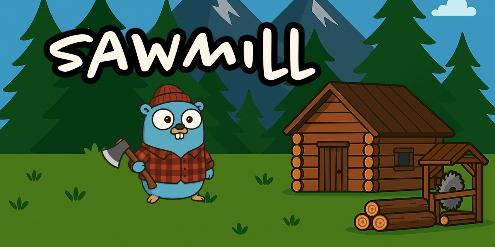
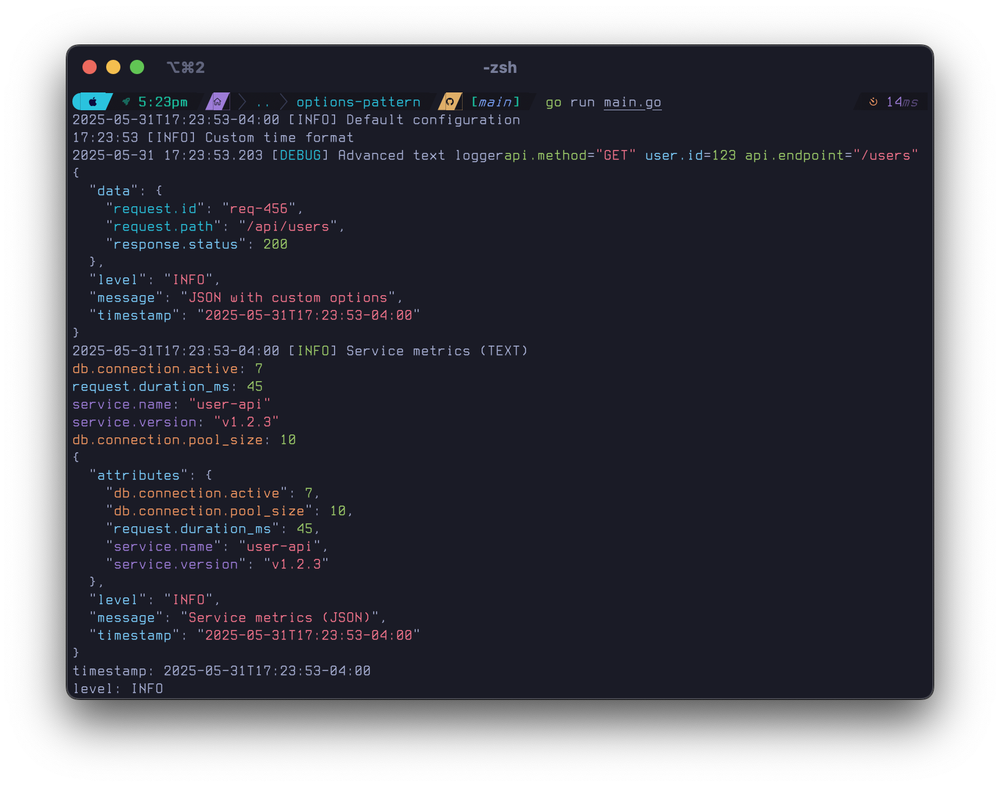

# Sawmill

**Sawmill** is a ZERO-dependency enhanced Go logging library that improves upon the standard `log/slog` package with nested key-value support, dynamic callbacks, flexible output formatting, and color syntax highlighting.

## Features

- 🌳 **Infinite Depth Nested Attributes** - Use hierarchical key-value pairs with unlimited nesting
- 🎨 **Color Syntax Highlighting** - Configurable color schemes for JSON and key-value output
- 🔄 **Dynamic Callbacks** - Runtime log modification with anonymous functions
- 📦 **Multiple Output Formats** - JSON, XML, YAML, and human-readable text
- 🎯 **Custom Attributes Keys** - Configurable attribute key names (default: "attributes")
- 📍 **Mark Function** - Logical separators for log sections
- 🔧 **Flexible Buffering** - Memory, file, and rotating file buffers
- 🔗 **slog Compatibility** - Drop-in replacement with additional features
- ⚡ **Thread-Safe** - Concurrent logging with immutable logger pattern

## Installation

```bash
go get github.com/bresrch/sawmill
```

## Quick Start

```go
package main

import "github.com/bresrch/sawmill"

func main() {
    // Basic logging
    sawmill.Info("User login", "user_id", 123, "ip", "192.168.1.1")
    
    // Nested attributes with dot notation
    logger := sawmill.New(sawmill.NewJSONHandlerWithDefaults())
    logger.WithDot("user.profile.name", "John Doe").
           WithDot("user.profile.email", "john@example.com").
           Info("User authenticated")
    
    // Logical separations
    sawmill.Mark("Starting data processing phase")
    sawmill.Info("Processing 1000 records")
    sawmill.Mark("Processing complete")
}
```

## Options Pattern

Sawmill uses the options pattern for clean, flexible configuration:



```go
// Create a customized handler with multiple options
logger := sawmill.New(sawmill.NewTextHandler(
    sawmill.NewHandlerOptions().
        WithLevel(sawmill.LevelDebug).
        WithColorsEnabled(true).
        WithColorMappings(map[string]string{
            "user":   sawmill.ColorBrightBlue,
            "error":  sawmill.ColorBrightRed,
        }).
        WithTimeFormat("15:04:05").
        WithAttributeFormat("flat").
        WithFile("/var/log/app.log", 100*1024*1024, true), // 100MB, compressed
))

// Or use defaults and customize selectively
logger := sawmill.New(sawmill.NewJSONHandler(
    sawmill.NewHandlerOptions().
        WithPrettyPrint(true).
        WithAttributesKey("data"),
))
```

## Core Features

### Nested Attributes

Create hierarchical log data with unlimited depth:

```go
// Using key paths
logger.WithNested([]string{"user", "profile", "preferences", "theme"}, "dark")

// Using dot notation (easier)
logger.WithDot("user.profile.preferences.theme", "dark")

// Using groups
userLogger := logger.WithGroup("user")
userLogger.Info("Action performed", "action", "login", "timestamp", time.Now())
```

### Temporary Format Switching

Change output format for specific messages without affecting others:

```go
logger := sawmill.Default() // Text format

logger.Info("Regular text message")
logger.As(sawmill.NewJSONFormatter()).Info("This one message in JSON")
logger.Info("Back to text format")
```

### Dynamic Callbacks

Modify log records at runtime:

```go
logger = logger.WithCallback(func(record *sawmill.Record) *sawmill.Record {
    hostname, _ := os.Hostname()
    record.WithDot("server.hostname", hostname)
    record.WithDot("server.pid", os.Getpid())
    return record
})

logger.Info("Request processed") // Automatically includes server info
```

### Color Syntax Highlighting

Beautiful terminal output with customizable colors:

```go
// Create colored loggers using options pattern
textLogger := sawmill.New(sawmill.NewTextHandler(
    sawmill.NewHandlerOptions().
        WithColorsEnabled(true).
        WithColorMappings(map[string]string{
            "user":        sawmill.ColorBrightBlue,   // All user.* keys
            "request":     sawmill.ColorBrightGreen,  // All request.* keys  
            "error_code":  sawmill.ColorBrightRed,    // Specific key coloring
        }),
))

jsonLogger := sawmill.New(sawmill.NewJSONHandler(
    sawmill.NewHandlerOptions().
        WithColorsEnabled(true).
        WithColorMappings(map[string]string{
            "user": sawmill.ColorBlue,
            "request": sawmill.ColorGreen,
        }),
))

textLogger.Info("Colored output", "user.name", "Alice", "request.method", "GET")
```

**Default Colors:**
- Keys: Blue
- String values: Red  
- Integer values: Green
- Float values: Yellow
- Boolean values: Magenta
- Null values: Cyan

### Mark Function for Logical Breaks

Create visual separations in your logs:

```go
sawmill.Mark("Authentication Phase")
sawmill.Info("Validating credentials")
sawmill.Info("Authentication successful")

sawmill.Mark("Data Processing", "batch_id", "batch-123", "total_records", 1000)
sawmill.Info("Processing records")
sawmill.Mark("Processing complete")
```

**Text Output:**
```
================================================================================
 MARK: Authentication Phase  [2025-05-31 13:18:12]
================================================================================
```

**JSON Output:**
```json
{"level":"MARK","message":"Authentication Phase","timestamp":"2025-05-31T13:18:12-04:00"}
```

### Custom Attributes Key

Change the default "attributes" key name:

```go
// Default behavior
defaultLogger := sawmill.New(sawmill.NewJSONHandlerWithDefaults())
defaultLogger.Info("Message", "key", "value")
// Output: {"attributes":{"key":"value"},"level":"INFO",...}

// Custom key name using options pattern
customLogger := sawmill.New(sawmill.NewJSONHandler(
    sawmill.NewHandlerOptions().WithAttributesKey("data"),
))
customLogger.Info("Message", "key", "value") 
// Output: {"data":{"key":"value"},"level":"INFO",...}
```

### Multiple Output Formats

Support for various output formats using the options pattern:

```go
// JSON with pretty printing
jsonLogger := sawmill.New(sawmill.NewJSONHandler(
    sawmill.NewHandlerOptions().WithPrettyPrint(true),
))

// XML output
xmlLogger := sawmill.New(sawmill.NewXMLHandlerWithDefaults())

// YAML output  
yamlLogger := sawmill.New(sawmill.NewYAMLHandlerWithDefaults())

// Multi-output logging with different configurations
multiHandler := sawmill.NewMultiHandler(
    sawmill.NewJSONHandler(
        sawmill.NewHandlerOptions().
            WithFile("app.json", 50*1024*1024, false).
            WithPrettyPrint(false),
    ),
    sawmill.NewTextHandler(
        sawmill.NewHandlerOptions().
            WithStdout().
            WithColorsEnabled(true),
    ),
)
logger := sawmill.New(multiHandler)
```

### Flexible Buffering

Various buffering strategies for performance:

```go
// Memory buffer with size limit
memBuffer := sawmill.NewMemoryBuffer(1024 * 1024) // 1MB

// File buffer with auto-sync
fileBuffer, err := sawmill.NewFileBuffer("app.log", 4096, 100*1024*1024, true)

// Rotating file buffer
rotatingBuffer, err := sawmill.NewRotatingFileBuffer("app.log", 10*1024*1024, 5, 4096)

// Writer buffer (wraps any io.Writer)
writerBuffer := sawmill.NewWriterBuffer(os.Stdout)
```

## Configuration

### SawmillOptions

Configure logging behavior:

```go
opts := &sawmill.SawmillOptions{
    LogFile:       "app.log",
    LogLevel:      "info",
    LogFormat:     "json",
    MaxSize:       100,  // MB
    MaxBackups:    7,
    MaxAge:        30,   // days
    Compress:      true,
    EnableDebug:   true,
    EnableInfo:    true,
    EnableWarn:    true,
    EnableError:   true,
}

logger := sawmill.New(sawmill.NewJSONHandler(nil, opts))
```

### Log Levels

Supported log levels:
- `TRACE` - Detailed debug information
- `DEBUG` - Debug information
- `INFO` - Informational messages
- `WARN` - Warning messages  
- `ERROR` - Error messages
- `FATAL` - Fatal error messages
- `PANIC` - Panic messages (calls panic())
- `MARK` - Logical separators

### Color Constants

Available color constants for custom mappings:

```go
// Basic colors
sawmill.ColorRed, sawmill.ColorGreen, sawmill.ColorYellow
sawmill.ColorBlue, sawmill.ColorMagenta, sawmill.ColorCyan, sawmill.ColorWhite

// Bright colors  
sawmill.ColorBrightRed, sawmill.ColorBrightGreen, sawmill.ColorBrightYellow
sawmill.ColorBrightBlue, sawmill.ColorBrightMagenta, sawmill.ColorBrightCyan
sawmill.ColorBrightWhite

// Special
sawmill.ColorBold
```

## Architecture

### Core Components

1. **RecursiveMap** - Tree-like data structure for nested attributes
2. **Logger Interface** - Enhanced logging with nested support and callbacks
3. **Handler System** - Multiple output format handlers with buffering
4. **Formatter System** - Pluggable output formatting (JSON, XML, YAML, Text)
5. **Buffer System** - Flexible output buffering strategies
6. **Color System** - Syntax highlighting with custom mappings

### Design Patterns

- **Immutable Loggers** - Logger methods return new instances with added attributes
- **Handler Composition** - Combine multiple handlers for different output needs
- **Buffer Management** - Configurable buffering strategies for performance
- **Format Abstraction** - Clean separation between data and presentation

### AI

If you're using AI in a project and would like to use this library, pass it `AI_RULES.md` as a quick way to provide it extra context for more accurate results.

## Examples

See the [examples/](examples/) directory for complete examples:

- `example.go` - Basic usage and features
- `color_example.go` - Color syntax highlighting demonstration

## Performance

Sawmill is designed for high-performance logging:

- Thread-safe operations with minimal locking
- Efficient memory usage with configurable buffering
- Lazy evaluation of expensive operations
- Minimal allocations in hot paths

## Compatibility

- **Go Version**: Requires Go 1.24.1 or later
- **slog Compatibility**: Drop-in replacement for standard library slog
- **Platform Support**: Cross-platform (Windows, macOS, Linux)

## Contributing

Contributions are welcome! Please see our contributing guidelines for details.

## License

This project is licensed under the MIT License - see the LICENSE file for details.

## Acknowledgments

- Inspired by Go's standard `log/slog` package
- The Go Gopher mascot was created by Renee French and is licensed under the Creative Commons 4.0 Attribution License
