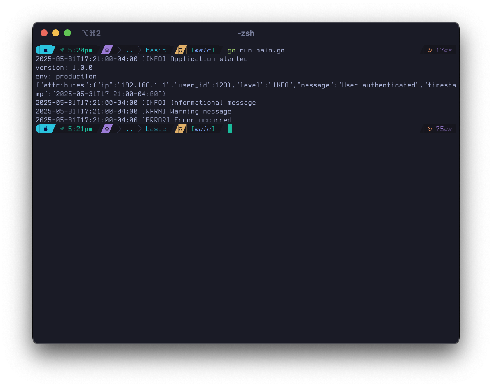
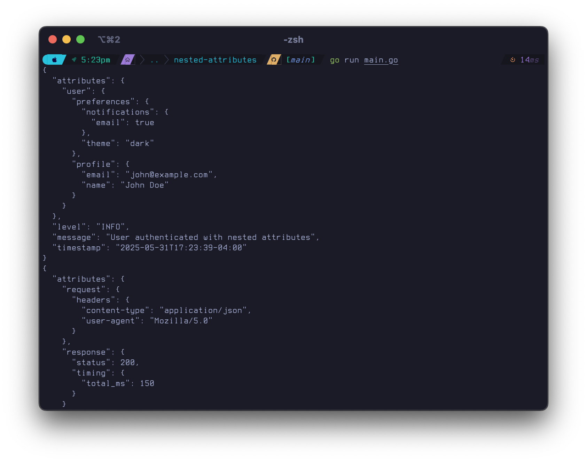
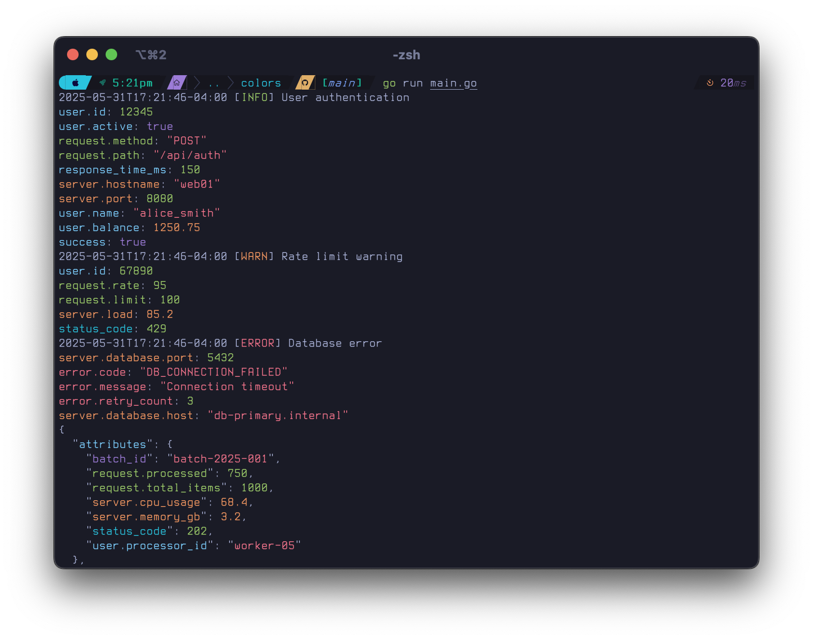
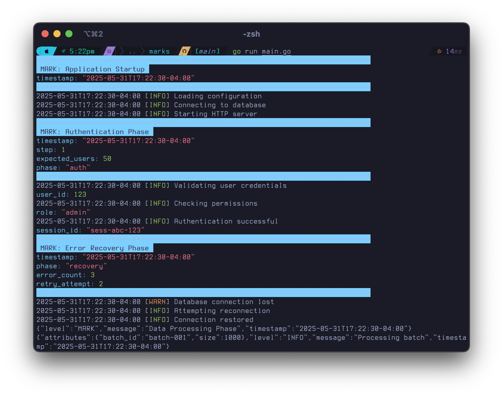
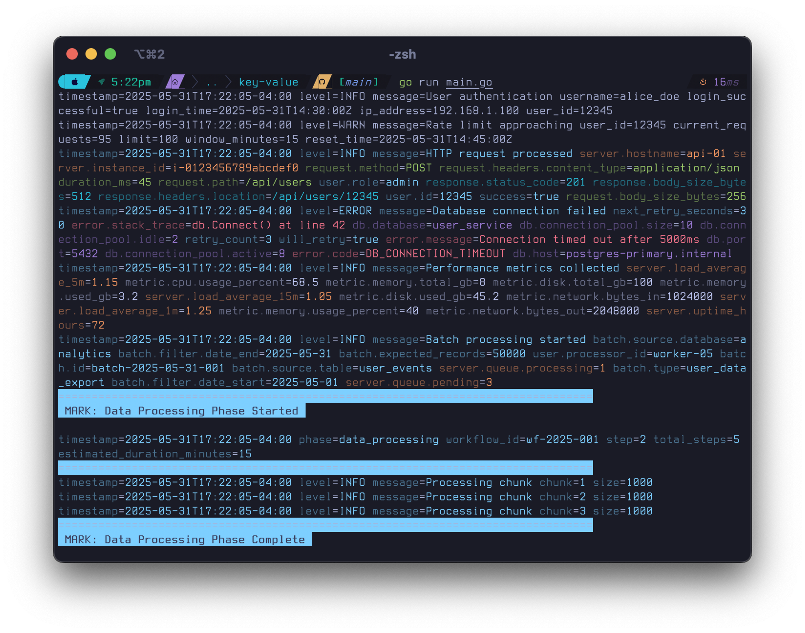
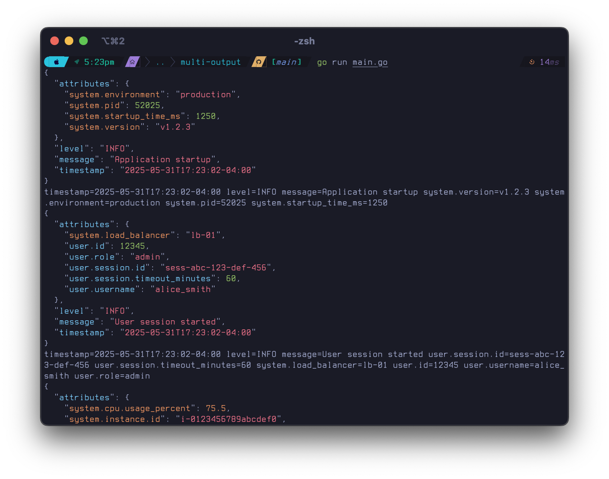
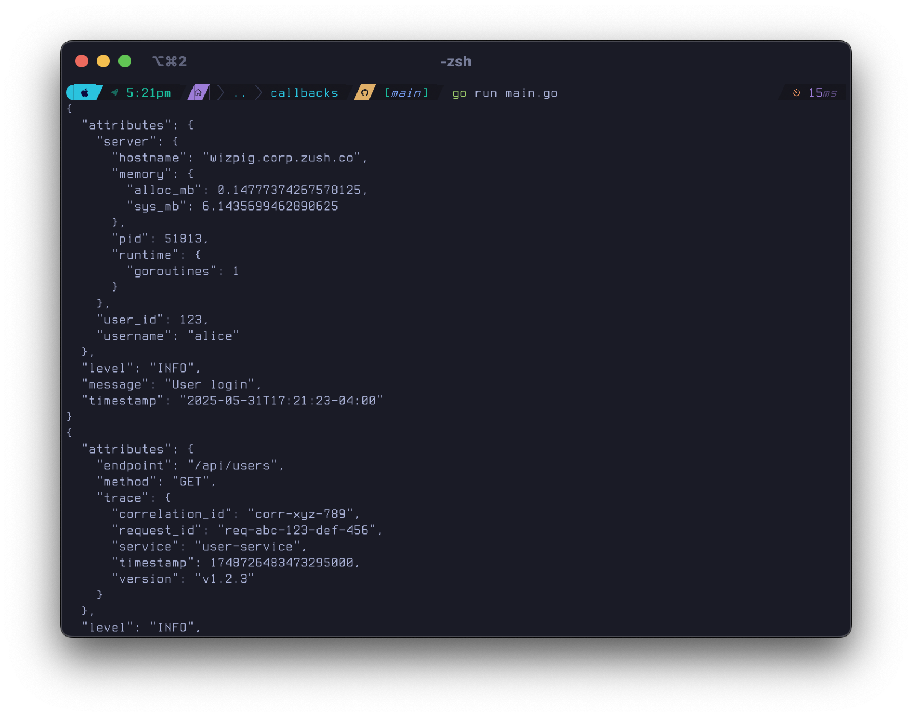

# Sawmill Examples

Reference implementations for production logging patterns using Sawmill. Each example demonstrates specific architectural patterns and integration strategies.

## Structure

```
examples/
├── basic/              # slog compatibility and basic operations
├── nested-attributes/  # Structured data organization patterns
├── colors/            # Terminal output optimization
├── marks/             # Process flow tracking
├── options-pattern/   # Configuration management
├── key-value/         # Machine-parseable output
├── multi-output/      # Fan-out logging architecture
└── callbacks/         # Runtime context injection
```

## Usage

Run from project root:

```bash
go run examples/basic/main.go
go run examples/key-value/main.go
./examples/run_all.sh  # All examples with build verification
```

## Implementation Patterns

### 1. Basic (`basic/`)
Drop-in slog replacement with enhanced structured logging.



**Implementation**: Package-level functions, default handlers, log level filtering
**Use Case**: Rapid prototyping, slog migration, simple applications

### 2. Nested Attributes (`nested-attributes/`)
Hierarchical data structures for complex domain models.



**Implementation**: Dot notation (`user.profile.name`), key paths, logical grouping
**Use Case**: E-commerce orders, user sessions, API request/response tracking

### 3. Colors (`colors/`)
Terminal output optimization for development and debugging.



**Implementation**: ANSI color codes, pattern-based key mapping, syntax highlighting
**Use Case**: Local development, debugging sessions, CI/CD pipeline output

### 4. Marks (`marks/`)
Process flow tracking and phase separation.



**Implementation**: Workflow delimiters, contextual markers, visual separators
**Use Case**: ETL pipelines, batch processing, multi-stage deployments

### 5. Options Pattern (`options-pattern/`)
Production configuration management with builder pattern.


**Implementation**: Method chaining, environment-specific configs, file rotation
**Use Case**: Production deployments, configuration management, environment isolation

### 6. Key-Value (`key-value/`)
Machine-parseable output for monitoring systems.



**Implementation**: Flat key=value format, color-coded keys, metric logging
**Use Case**: Prometheus integration, log aggregation, alerting systems

### 7. Multi-Output (`multi-output/`)
Fan-out logging architecture for different consumers.



**Implementation**: Multiple handlers, level-based routing, format specialization
**Use Case**: Production monitoring, audit logging, development debugging

### 8. Callbacks (`callbacks/`)
Runtime context injection and cross-cutting concerns.



**Implementation**: Middleware pattern, request tracing, dynamic enrichment
**Use Case**: Distributed tracing, user context, performance monitoring

## Architecture Patterns

### Environment-Based Configuration
```go
func NewLogger(env string) sawmill.Logger {
    switch env {
    case "development":
        return sawmill.New(sawmill.NewTextHandler(
            sawmill.NewHandlerOptions().
                WithLevel(sawmill.LevelDebug).
                WithColorsEnabled(true)))
    case "production":
        return sawmill.New(sawmill.NewJSONHandler(
            sawmill.NewHandlerOptions().
                WithFile("/var/log/app.jsonl", 100*1024*1024, true).
                WithLevel(sawmill.LevelInfo)))
    default:
        return sawmill.DefaultLogger
    }
}
```

### Request Context Injection
```go
func WithRequestContext(logger sawmill.Logger, r *http.Request) sawmill.Logger {
    return logger.WithCallback(func(record *sawmill.Record) *sawmill.Record {
        record.WithDot("request.id", middleware.GetRequestID(r))
        record.WithDot("request.method", r.Method)
        record.WithDot("request.path", r.URL.Path)
        return record
    })
}
```

### Error Enrichment
```go
func WithErrorContext(logger sawmill.Logger) sawmill.Logger {
    return logger.WithCallback(func(record *sawmill.Record) *sawmill.Record {
        if record.Level >= sawmill.LevelError {
            record.WithDot("runtime.goroutines", runtime.NumGoroutine())
            record.WithDot("runtime.stack_trace", debug.Stack())
        }
        return record
    })
}
```

## Performance Notes

- **Callback execution**: O(n) per log entry where n = callback count
- **Multi-handler fan-out**: Each handler processes independently
- **Nested attribute overhead**: Deep nesting creates object allocation
- **File I/O**: Use buffering for >1000 logs/sec workloads

## Production Integration

### Monitoring Systems
```go
// Prometheus metrics logging
metricsLogger := sawmill.New(sawmill.NewKeyValueHandler(
    sawmill.NewHandlerOptions().WithFile("/var/log/metrics.log")))

// Application event logging  
auditLogger := sawmill.New(sawmill.NewJSONHandler(
    sawmill.NewHandlerOptions().WithFile("/var/log/audit.jsonl")))
```

### Service Mesh Integration
```go
func WithTracing(logger sawmill.Logger, span trace.Span) sawmill.Logger {
    return logger.WithCallback(func(record *sawmill.Record) *sawmill.Record {
        record.WithDot("trace.span_id", span.SpanContext().SpanID())
        record.WithDot("trace.trace_id", span.SpanContext().TraceID())
        return record
    })
}
```

### Database Connection Pools
```go
func LogDBMetrics(logger sawmill.Logger, db *sql.DB) {
    stats := db.Stats()
    logger.Info("Database pool status",
        "open_connections", stats.OpenConnections,
        "in_use", stats.InUse,
        "idle", stats.Idle)
}
```

## Implementation Guidelines

1. **Structured over interpolated**: `logger.Info("user login", "user_id", 123)` not `logger.Info("user 123 login")`
2. **Consistent key naming**: Use dot notation for hierarchical data (`user.profile.email`)
3. **Level discipline**: Debug for development, Info for business events, Error for actionable failures
4. **Context isolation**: Use callbacks for request/session context, direct attributes for business data
5. **Format specialization**: JSON for aggregation, key-value for metrics, text for development